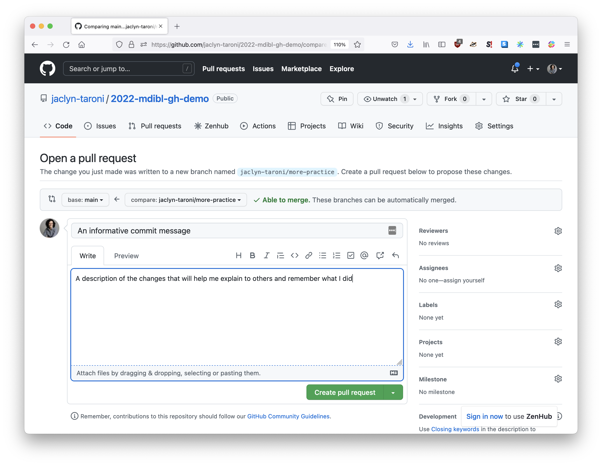

# Intro to Git and GitHub

The topic of Git and GitHub could easily fill the entirety of this course!
That is not practical (or allowed 😁), so instead, our objective is to provide a brief introduction such that you get a sense of _why_ you might use git and GitHub in your research and how to get started.

Git has a steep learning curve. 
You will mess up and get frustrated (I do each and every week). 
But it also can be very useful and rewarding for you and your work!

<!-- START doctoc generated TOC please keep comment here to allow auto update -->
<!-- DON'T EDIT THIS SECTION, INSTEAD RE-RUN doctoc TO UPDATE -->
**Table of Contents**

- [Getting started](#getting-started)
- [Background and definitions](#background-and-definitions)
- [Advantages of Git and GitHub for computational research](#advantages-of-git-and-github-for-computational-research)
- [An incomplete list of DOs and DON'Ts](#an-incomplete-list-of-dos-and-donts)
    - [✅ DO](#-do)
    - [❌ DON'T](#-dont)
- [The very basics](#the-very-basics)
    - [Creating a repo on GitHub](#creating-a-repo-on-github)
    - [Editing through merging viia the GitHub web interface](#editing-through-merging-viia-the-github-web-interface)
    - [Editing README.md](#editing-readmemd)
    - [Creating and merging a pull request](#creating-and-merging-a-pull-request)
    - [Cloning with GitHub Desktop](#cloning-with-github-desktop)
    - [Creating a branch with GitHub Desktop](#creating-a-branch-with-github-desktop)
     - [Adding to a branch locally](#adding-to-a-branch-locally)
- [Resources for continued learning](#resources-for-continued-learning)

<!-- END doctoc generated TOC please keep comment here to allow auto update -->

## Getting started

If you'd like to follow along with the exampels below yourself, you need:

* [Git](https://docs.github.com/en/get-started/quickstart/set-up-git#setting-up-git)
* [A configured GitHub account](https://docs.github.com/en/get-started/onboarding/getting-started-with-your-github-account)
* [GitHub Desktop](https://docs.github.com/en/desktop/installing-and-configuring-github-desktop/installing-and-authenticating-to-github-desktop/setting-up-github-desktop)

## Background and definitions

**Git** is version control software used for tracking changes to code and (small) data files. 
You can use it to keep track of incremental changes to your project files indefinitely (i.e., for longer than version control in other services Dropbox). 
It helps you avoid hanging onto multiple copies of code files that ostensibly serve the same function with names like `run_analysis.R`, `run_analysis_v2.R`, and `run_analysis_final.R` because you can instead update your original script (here, `run_analysis.R`) with a record of prior versions and the capability of reverting to an earlier version (i.e., before you broke something!).

**Repository (or repo for short)** is a directory or folder that contains the files under version control with Git, and a hidden subfolder (`.git`) that contains the files necessary for Git's operation.
In practice, a repository often corresponds to a scientific project.

When something is said to be **remote**, we're referring to a copy of the repository and the files it contains hosted on the internet.

When something is said to be **local**, we're referring to files saved on your own computer ("locally").
You can **clone** a remote repository to get a local copy.

**GitHub** is a popular cloud service is specifically designed for working with and hosting it repos. 
It allows you to back up the code you have locally.
(Side note: Other services that sync to the cloud like Google Drive and Dropbox sometimes do not play nicely with Git!)
GitHub also has other features that allow you to track your work and collaborate with others.

A **commit** is a "snapshot" of the changes made to files you've added to be tracked with git. 
One way to think about an individual commit, which gets its own identifier, is a point in a timeline of in your work that you could revert to (or roll back changes to) if needed.

A **diff**, as we'll use the term here, is a graphical display of the changes or _differences_ between two versions of the same file.

A **branch** allows you to commit your changes to a separate or independent line of development ([ref](https://www.atlassian.com/git/tutorials/using-branches)).
In practice, it's helpful to use Git branches when adding a new "unit of work" like a script or step in an analysis, particularly when collaborating with others.

A **pull request** is an event where you _request_ to merge changes from your branch to the default branch (typically `main` on GitHub) in a project; a **merge** puts together the history of the two branches.
On GitHub, the pull request interface allows contributors to a project to have a discussion about the changes via comments.

**GitHub Desktop** is a GUI or Graphical User Interface that provides an interface to Git commands like creating branches, committing changes, and publishing your changes to GitHub.

## Advantages of Git and GitHub for computational research

_Analogy [borrowed from "Happy Git and GitHub for the useR" by Jenny Bryan](https://happygitwithr.com/big-picture.html)_

Let's compare two scenarios for writing and editing a paper collaboratively; I expect at least one of them to be somewhat familiar!

**Scenario 1**

You are writing your paper in Microsoft Word.
You send your paper to your coauthors for review via email.
You ask them to send back any changes in a new file, where they've appended their initials to the original file name.
Multiple coauthors send back edits, along with some context for their comments in the body of the email.
You have to reconcile them into a single document called `manuscript_v2.docx`.
There are 5 more rounds of this cycle; your final manuscript file is called `manuscript_final_v2.docx` (because you got overconfident about when and if something was really final!).
All of these different versions live in the same folder, and it can be difficult to quickly find the version that you need.

**Scenario 2**

You are writing your paper in Google Docs.
Your collaborators all have access to the Google Doc, which lives in the cloud; there is only one version.
Any collaborator can propose changes using suggestions.
All changes can be attributed to any individual person editing the document.
If you need to roll back changes because the most recent rewrite was unsuccessful, you can use the history of the document to do so.

Scenario 2 sounds a lot more pleasant to me!
Using Git and GitHub to collaborate is much closer to Scenario 2, than Scenario 1. 
It brings the powerful features of Google Docs for tracking work (including comments in some cases) to code and machine-readable data files, which are typically edited in text editors or integrated development environments (IDEs; RStudio is one example of an IDE).

## An incomplete list of DOs and DON'Ts

When working with Git and GitHub:

### ✅ DO

* **Do plan to track even "minor" steps** like how you downloaded data. 
  This is a general approach you should take to making your work more reproducible, but Git and GitHub can be part of your strategy for doing so!
* **Do commit often.**
  If you're making smaller commits, more often, it will be easier to figure out what you did later.
  Use informative commit messages too!
* **Do add documentation** above and beyond comments in your code with Markdown documents.
  What do others, and mostly you 6-months-from-now, need to know about the code to get started using it?
  For example, I was able to quickly update data for this year's material with new software versions because Past Jaclyn left me instructions here: <https://github.com/jaclyn-taroni/2022-mdibl-fair/tree/main/setup/bulk-rnaseq#set-up-for-bulk-rna-seq-instruction-materials>

### ❌ DON'T

* **Don't commit anything you'd never want to make public**, like passwords, API keys, or private data that you would not release without restriction.
* **Don't commit large (> 100MB) files.**
  You will not be able to push them to GitHub, and keeping track o large files impact Git's performance, too.
  

## The very basics 

In this section, we'll run through:

* Creating a new repository on GitHub.
* Editing a file, committing the changes to a new branch, and creating and merging a pull request on the GitHub web interface.
* Cloning the repository locally to your computer with GitHub Deskop.
* Creating a branch locally with GitHub Desktop.
* Adding and committing changes to a branch with GitHub Desktop.
* Viewing your commit history in GitHub Desktop.
* Publishing your changes to GitHub with GitHub Desktop.

#### Creating a repo on GitHub

If you are logged into GitHub, you can create a new repository by navigating to <https://github.com/new> in your browser.

Enter an informative repository name in the `Repository name` field (here I'm using `2022-mdibl-gh-demo`) and an informative description in the `Description` field.

Set to **Public**, though it doesn't matter much here!

Make sure to ☑️ **Add a README file**.

Scroll down and click `Create repository`.
The other options (Add a .gitignore and add a license) are beyond the scope of this exercise.

#### Editing through merging via the GitHub web interface

You should be redirected to the root (kind of like a home page) of your brand new repository, which will look something like the screenshot below.

#### Editing README.md

To edit the `README.md` file via the GitHub interface, click the pencil icon in the upper right hand corner as shown with an arrow below.

You will be taken to a page that allows you to edit the file. 
Update the text as you see fit! 
I'm only changing whitespace in the example below.

Scroll down to save your changes.
Specifically, add an informative message describing the changes you're making to the box below **Commit changes** (this will be your commit message), then select `Create a new branch for this commit and start a pull request.`
You may want to update the branch name to also be informative; I am using `jaclyn-taroni/more-practice` in this example.

Hit the `Propose changes` button.

#### Creating and merging a pull request

You'll be taken to the pull request page.
You can enter a new title for the pull request (it's good if it's informative).

You can also add a description of the changes as a comment.
And you're ready to hit the `Create pull request` button!

This is what a created or filed pull request looks like:

At the top, we can see that I am merging one commit `jaclyn-taroni/more-practice` into `main`.

To _merge_ a pull request, hit `Merge pull request` and `Confirm merge`.

When working collaboratively, your collaborators might comment on your pull request before you merge it.
That's arguably the main benefit of a pull request – they are not the only way to merge your code into the `main` branch!
They can still be useful when working alone, in my opinion, for surfacing the steps you took and why.
Check out [the pull requests I made while updating developing the material for this course](https://github.com/jaclyn-taroni/2022-mdibl-fair/pulls?q=is%3Apr+is%3Aclosed) to see this in action.

If you navigate back to the root of the repo, you should see your changes in the README now!
And the latest commit, shown in the red box, should begin with `Merge pull request`.

#### Cloning with GitHub Desktop

All the steps above happened on GitHub to the remote version of the repository.

Usually, when you're working on a scientific project, you'll want to make changes to code and data locally on your computer.

You can _clone_, or get a local copy, of your repo using GitHub Desktop.
Open up GitHub Desktop and then look under the `File` menu for `Clone Repository`. 

The modal below should appear and you can start typing the name of your repository to find and select it.

Pay attention to where on your computer the local copy will go by reviewing the value in `Local Path`.
In the example below, I can expect to find a `2022-mdibl-gh-demo` folder in `Documents/GitHub` once I've cloned the repository.

Click the `Clone` button.

By navigating to `Documents/GitHub` in Finder on my Mac (Windows Explorer is the Windows equivalent), I can see the contents of the repository are now on my computer, complete with a hidden `.git` folder with everything necessary for operating the Git repo.

If you click on the `History` tab on the left hand side, we can see that the commit from `jaclyn-taroni/more-practice` is now in the `main` branch, as is a commit from merging the pull request in to `main`.

The practice of starting a new branch to make changes is known as creating a feature branch, where you start with a commit from `main` and then create a new branch to develop on and add commits, represented as circles, to independently ("Little Feature" and "Big Feature" below).

_Source: [Atlassian Git Tutorial](https://www.atlassian.com/git/tutorials/using-branches)_

When we filed a pull request and merged it, we created a new commit in `main` incorporating the history from our feature branch.

_Source: [Atlassian Git Tutorial](https://www.atlassian.com/git/tutorials/using-branches/git-merge)_

#### Creating a branch with GitHub Desktop

We can use the branches tab to create a new branch.
I'm calling my `jaclyn-taroni/link-to-main-repo` because I'll use this branch to add a link to the repository with the material for this course, and I'm creating the branch from `main`.

#### Adding to a branch locally

With a new branch created and checked out, we're ready to develop as we might normally with files on our computer.
You can open the `README.md` file for your repository in any text editor to write in a markup language called [Markdown](https://en.wikipedia.org/wiki/Markdown).

The same concept applies to analytical code – use whatever process you'd normally use to update your R code files.

In the screenshot below, I'm editing in a text editor called [Sublime](https://www.sublimetext.com/).

Once you _save_ changes to a file, you are able to commit them to your local copy of the repo in the `Changes` tab.

You can check the checkbox to include changes to that file in the next commit.

On the right hand side, you can see a diff that shows the changes to the `README.md` since it was last committed.

Use the text field in the lower lefthand side to add a commit message and commit the changes.

If we navigate back to the `History` tab, we can see the new commit, along with the changes that were committed. 

These changes are only in our local copy of the repo right now; they haven't made it back to the remote copy on GitHub yet.

To sync the changes back up to GitHub, we need to click `Publish branch`.
This is called _pushing_ your changes in many other Git clients like Sourcetree or at the command line.

Once we've published our changes, we can navigate back to the root of our repo on GitHub in our web browser.

GitHub let's us know that we have a branch with recently pushed (published) changes with a banner.
If we wanted to create a pull request, we could click the `Compare & pull request` button and [follow the same steps as above](#creating-and-merging-a-pull-request)!

With these steps, we've covered the very basics of using Git and GitHub.
Check out the resources below for more in-depth tutorials.

## Resources for continued learning

* [Hello World exercise from GitHub](https://docs.github.com/en/get-started/quickstart/hello-world)
* [Version Control with Git from The Carpentries](https://swcarpentry.github.io/git-novice/)
* [Happy Git and GitHub for the useR](https://happygitwithr.com/index.html)

